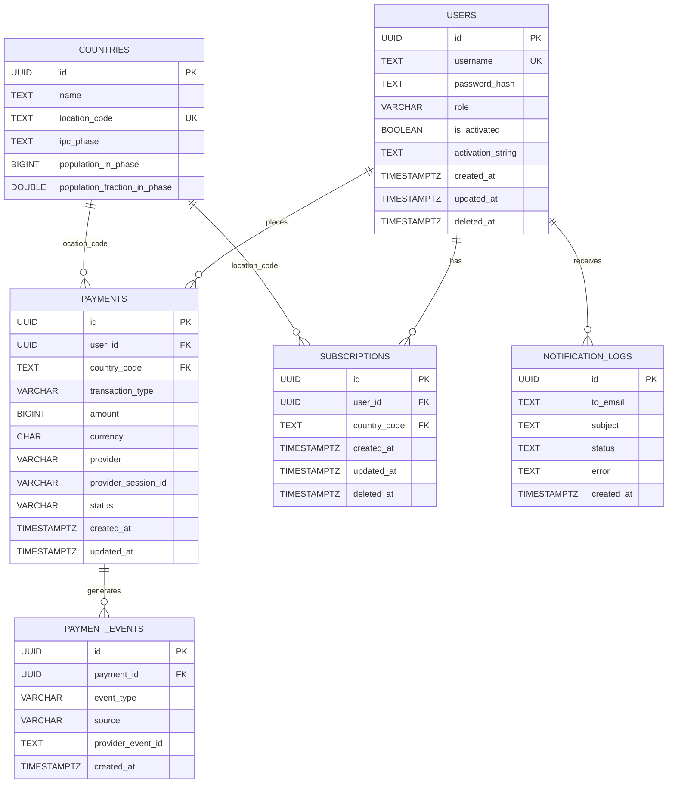

```mermaid 
erDiagram
    USERS ||--o{ PAYMENTS : places
    USERS ||--o{ SUBSCRIPTIONS : has
    PAYMENTS ||--o{ PAYMENT_EVENTS : generates
    COUNTRIES ||--o{ PAYMENTS : "location_code"
    COUNTRIES ||--o{ SUBSCRIPTIONS : "location_code"
    USERS ||--o{ NOTIFICATION_LOGS : receives

    USERS {
        UUID id PK
        TEXT username UK
        TEXT password_hash
        VARCHAR role
        BOOLEAN is_activated
        TEXT activation_string
        TIMESTAMPTZ created_at
        TIMESTAMPTZ updated_at
        TIMESTAMPTZ deleted_at
    }

    PAYMENTS {
        UUID id PK
        UUID user_id FK
        TEXT country_code FK
        VARCHAR transaction_type
        BIGINT amount
        CHAR currency
        VARCHAR provider
        VARCHAR provider_session_id
        VARCHAR status
        TIMESTAMPTZ created_at
        TIMESTAMPTZ updated_at
    }

    PAYMENT_EVENTS {
        UUID id PK
        UUID payment_id FK
        VARCHAR event_type
        VARCHAR source
        TEXT provider_event_id
        TIMESTAMPTZ created_at
    }

    SUBSCRIPTIONS {
        UUID id PK
        UUID user_id FK
        TEXT country_code FK
        TIMESTAMPTZ created_at
        TIMESTAMPTZ updated_at
        TIMESTAMPTZ deleted_at
    }

    NOTIFICATION_LOGS {
        UUID id PK
        TEXT to_email
        TEXT subject
        TEXT status
        TEXT error
        TIMESTAMPTZ created_at
    }

    COUNTRIES {
        UUID id PK
        TEXT name
        TEXT location_code UK
        TEXT ipc_phase
        BIGINT population_in_phase
        DOUBLE population_fraction_in_phase
    }
```
