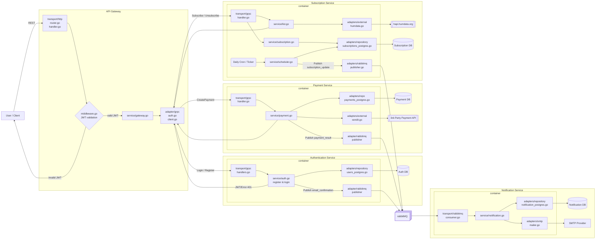

[![](https://mermaid.ink/img/pako:eNqlWPtv4kYQ_lesle7ESSQ8kwBqT00ITahCwvFo2hqEFnsDq_Pr1nYSGvjfb3bttdfEpkePH0LGM9_sPL4Z27whwzUJ6qAny30x1pgF2t1o5swcDT4fPmi_Fn0Si65FiRNoH7XLYV-7wQF5wZsfhU99wnT-R6vEfubybD9crhj21tztzaOuOJ9HBvxz87i4nUyGesCw43suCyrrIPB-WbLKZ-aGAWGnK1dIa-yYlhCz6MHjm01NUL1gRqTxH48T7Rlb1MQBdZ1dBjD-s6tDvM_UIJVVFM87pzejYVfHJvYggMqKeYbwisNgLU8wRK4pkDimzFtU4-Tk83bUG0-2MsNIFwtcHQWfXB48CoyIWoP4t3Gs-wbUUUz4UYkBGEu_PP6jKHAJqUE-1BAF08ZRfX7UQdrp6eRWz_elFDhjvqjphusEmDqEKTb8I9SiFSk7kmbEfPCzvUtgapfVvjGyoj50FdhuuSvq5GFHveGD7L5fYcRzfRq4bCMchODVX8ClYMVI0emDLwl7GF4uaWB_E2AvXFrUX2cyFcyRwvXVQtSwxIsI0qf39IrbK8hwx1OAyRvFWW3TmkXGiSiYISuj6GLSbIFOlR5jLtOa1dp2n0OqaVojRcdFoYwTyANuh1H2GrExtRbQ9SfKbEGSrSzbUaQd4o3NF9f_Zevw8m99z0ceS8HsAEm59j84-p4kHKQy1IuiyDc8hkwS857CESQ65xB_Obr31yQFk1f4crAlHLwCEelenPsE5mUtybqmFI6dw21A1xvMPBnCnWqT9BAuzw9zvcsIbOvYfpvUPTKUkuBgXN1UU7AZVVWcdqoAQSogtiJIOgZSklMAcg4omYG4EwvoQWjF6RxJ_3G49A1GvZ_a2OPplZ7nKG8QwPbAIHDt0YPAQVCaBXyPk2nwlXiKIXf98SSBQE2DAtPube86dW2siRkWhnJw86thHZog7qh4gtahDU8lOB-WjrpfMOv5uO7o4b50DVt1o3WZy-8IE2p8JexTwZTeTge6vsYePZXhuGw1n2fGmDOjlKHG3u2I__N-TGPEkkAQU8eX0jbhRwSRkhgXtaWpWl7Jjm6uNi55qpXTC4mqgeaeyrmX9cuvJCbpiEtJjjjIcmBlE1LHnHaKVy4WuEx0yXJQmbYIPWhQXL9oQxyxI0aCRNrgy7ELYnR5ddWfwIG_vWk-MIV0NI-5hl_WLLwkVkeboYigEBLaZW73cBhPNPGQLsF8TZRYniYRhfL-YdL__dglee8G9OlnH2vFyXqeq7w1GcVZvChlHsqizMw64PzQzhv1CKk-ODhKTEX2B5ea6uDATotPHsCbWuLJt-MXNf44tx_u_kNBVMJSpobZZ4Pe4LJ_p_MjtCFzn6mZFE55IJC1Uwgh7vSqVt6f0-xVrTrA4sohMI8mox3E724i2JmDymjFqIk6AQtJGUHToBYgojeOmiF4EbLJDPFpMTH7OkMzZwcYDzv_uK4tYfCiu1qjzhO2fJCieb-mGNiUmkANCOu6oROgTq3eblSFF9R5Q6-oc1Jrthqn1Va10W5dNM6arfZ5GW3gerPZOG3X6rVWs9Gsts_rFxe7MvpXHN04rZ-Ddb1dbbTqjdZZ_ayMiMmJMYh-ThC_Kuy-AwBh3IM?type=png)](https://mermaid.live/edit#pako:eNqlWPtv4kYQ_lesle7ESSQ8kwBqT00ITahCwvFo2hqEFnsDq_Pr1nYSGvjfb3bttdfEpkePH0LGM9_sPL4Z27whwzUJ6qAny30x1pgF2t1o5swcDT4fPmi_Fn0Si65FiRNoH7XLYV-7wQF5wZsfhU99wnT-R6vEfubybD9crhj21tztzaOuOJ9HBvxz87i4nUyGesCw43suCyrrIPB-WbLKZ-aGAWGnK1dIa-yYlhCz6MHjm01NUL1gRqTxH48T7Rlb1MQBdZ1dBjD-s6tDvM_UIJVVFM87pzejYVfHJvYggMqKeYbwisNgLU8wRK4pkDimzFtU4-Tk83bUG0-2MsNIFwtcHQWfXB48CoyIWoP4t3Gs-wbUUUz4UYkBGEu_PP6jKHAJqUE-1BAF08ZRfX7UQdrp6eRWz_elFDhjvqjphusEmDqEKTb8I9SiFSk7kmbEfPCzvUtgapfVvjGyoj50FdhuuSvq5GFHveGD7L5fYcRzfRq4bCMchODVX8ClYMVI0emDLwl7GF4uaWB_E2AvXFrUX2cyFcyRwvXVQtSwxIsI0qf39IrbK8hwx1OAyRvFWW3TmkXGiSiYISuj6GLSbIFOlR5jLtOa1dp2n0OqaVojRcdFoYwTyANuh1H2GrExtRbQ9SfKbEGSrSzbUaQd4o3NF9f_Zevw8m99z0ceS8HsAEm59j84-p4kHKQy1IuiyDc8hkwS857CESQ65xB_Obr31yQFk1f4crAlHLwCEelenPsE5mUtybqmFI6dw21A1xvMPBnCnWqT9BAuzw9zvcsIbOvYfpvUPTKUkuBgXN1UU7AZVVWcdqoAQSogtiJIOgZSklMAcg4omYG4EwvoQWjF6RxJ_3G49A1GvZ_a2OPplZ7nKG8QwPbAIHDt0YPAQVCaBXyPk2nwlXiKIXf98SSBQE2DAtPube86dW2siRkWhnJw86thHZog7qh4gtahDU8lOB-WjrpfMOv5uO7o4b50DVt1o3WZy-8IE2p8JexTwZTeTge6vsYePZXhuGw1n2fGmDOjlKHG3u2I__N-TGPEkkAQU8eX0jbhRwSRkhgXtaWpWl7Jjm6uNi55qpXTC4mqgeaeyrmX9cuvJCbpiEtJjjjIcmBlE1LHnHaKVy4WuEx0yXJQmbYIPWhQXL9oQxyxI0aCRNrgy7ELYnR5ddWfwIG_vWk-MIV0NI-5hl_WLLwkVkeboYigEBLaZW73cBhPNPGQLsF8TZRYniYRhfL-YdL__dglee8G9OlnH2vFyXqeq7w1GcVZvChlHsqizMw64PzQzhv1CKk-ODhKTEX2B5ea6uDATotPHsCbWuLJt-MXNf44tx_u_kNBVMJSpobZZ4Pe4LJ_p_MjtCFzn6mZFE55IJC1Uwgh7vSqVt6f0-xVrTrA4sohMI8mox3E724i2JmDymjFqIk6AQtJGUHToBYgojeOmiF4EbLJDPFpMTH7OkMzZwcYDzv_uK4tYfCiu1qjzhO2fJCieb-mGNiUmkANCOu6oROgTq3eblSFF9R5Q6-oc1Jrthqn1Va10W5dNM6arfZ5GW3gerPZOG3X6rVWs9Gsts_rFxe7MvpXHN04rZ-Ddb1dbbTqjdZZ_ayMiMmJMYh-ThC_Kuy-AwBh3IM)
