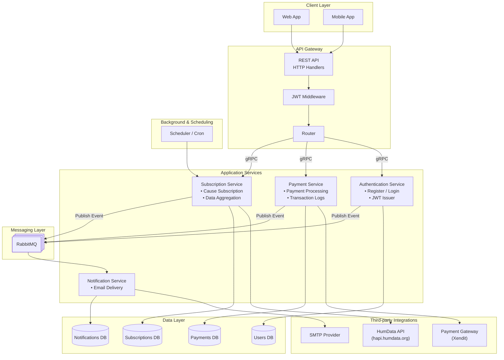

[![](https://mermaid.ink/img/pako:eNp9Vutu2jAUfhXLUicqAYXSdICmahSqXlQmCkydRqbJSdxgNSSRk9CyFmm_9gB7hD1an2THdpI6aSgSivOd43M_HzxhO3Ao7uM7L3iwl4THaH5q-gg-e3to6DHqx-iabChXYJRYLifhMhX9lKKFiQua-IdSFp9bai3giwZhqKHjwGIeXaiHJqO-Y_q5-8HkEp2TmD6QTcl7ioJjXUf3ezGfTxbTs9lcWPlk8YMTgaAL4jse5ZGmeXU7X8AXjZkDogfCqSacBkkMCapHdZBh6DGbxCzw0YzyNbNpVIo2g0W4Vdp63IMkXs7WtlCFE9S0pC1Tefn9D02pyyIICh2g68Blfi4QuVxGUVJqxIRslF04rESvygYzfMIDCCpivpuL5pz4EbFlHOCsGPEssZRhOEQ2Z2FluEOSRBTpKrloRGKCBq7LqStTLVj_EsTsTtmXx13lOFsR5qER9dia8tdRKPZqDHkRqJVbalCOg5f8XDHM45vPTyhakpD2UQhliurIIxb1-sjEU2JZLB7fmHhb5VomWbVIQgBuNXl5HEani9rXCIYWjU73ix0VorRvZamslpDrZSsrQT-Eit4WXaWYwtkjjJtPPHTpxxSCl9qlbDIdyGi-ZNxphEApm-KN0lSK4M9vtcFM11m2tvYNYmDxfnG3k1VatfSU73gNesOay2TlANoMuFu8OBsDKcCgwkOM-Zo5WrmLyc7sJXUS7-2sXAWWWORTYt-7PEh8B33QlXV3Qx74wp2SylUV0A6PKYW-_PlbJD3Bno3GiWQ0haS0WQQlvQkI9l8hgggEoMhL85Sal64yEkI1dzoZ7isddUNcfhboc8ZKO6SKWnYIFT3ohAm2MrcKTK3LYNXAv8GfJ4nlsQgGbA1FeoZN1CyWGE3hKihpMx-yKknm7BV911cVySmhSlR1RY3lG1yum0LFIGRYXrxX1XdjqCLCdDJupM2MNBWYvSl342xgCnDKFqaP69jlzMH9mCe0jleUA7HCK34St0wMv0kramLBeA7h9yY2_S3cCYn_PQhW2TVYDHeJ-3fEi-AtCWEd6YgR2KBVjnIYf8qHsEIx7rfbra60gvtP-BH3G0a32el2Wr2P3c5hyzg-Nup4A3C71W52Do8Mo9szjF6v0zra1vEv6bndbB8f9o56R0a70wOpAVcocEfAx-ovjvyns_0PQw3Wjg?type=png)](https://mermaid.live/edit#pako:eNp9Vutu2jAUfhXLUicqAYXSdICmahSqXlQmCkydRqbJSdxgNSSRk9CyFmm_9gB7hD1an2THdpI6aSgSivOd43M_HzxhO3Ao7uM7L3iwl4THaH5q-gg-e3to6DHqx-iabChXYJRYLifhMhX9lKKFiQua-IdSFp9bai3giwZhqKHjwGIeXaiHJqO-Y_q5-8HkEp2TmD6QTcl7ioJjXUf3ezGfTxbTs9lcWPlk8YMTgaAL4jse5ZGmeXU7X8AXjZkDogfCqSacBkkMCapHdZBh6DGbxCzw0YzyNbNpVIo2g0W4Vdp63IMkXs7WtlCFE9S0pC1Tefn9D02pyyIICh2g68Blfi4QuVxGUVJqxIRslF04rESvygYzfMIDCCpivpuL5pz4EbFlHOCsGPEssZRhOEQ2Z2FluEOSRBTpKrloRGKCBq7LqStTLVj_EsTsTtmXx13lOFsR5qER9dia8tdRKPZqDHkRqJVbalCOg5f8XDHM45vPTyhakpD2UQhliurIIxb1-sjEU2JZLB7fmHhb5VomWbVIQgBuNXl5HEani9rXCIYWjU73ix0VorRvZamslpDrZSsrQT-Eit4WXaWYwtkjjJtPPHTpxxSCl9qlbDIdyGi-ZNxphEApm-KN0lSK4M9vtcFM11m2tvYNYmDxfnG3k1VatfSU73gNesOay2TlANoMuFu8OBsDKcCgwkOM-Zo5WrmLyc7sJXUS7-2sXAWWWORTYt-7PEh8B33QlXV3Qx74wp2SylUV0A6PKYW-_PlbJD3Bno3GiWQ0haS0WQQlvQkI9l8hgggEoMhL85Sal64yEkI1dzoZ7isddUNcfhboc8ZKO6SKWnYIFT3ohAm2MrcKTK3LYNXAv8GfJ4nlsQgGbA1FeoZN1CyWGE3hKihpMx-yKknm7BV911cVySmhSlR1RY3lG1yum0LFIGRYXrxX1XdjqCLCdDJupM2MNBWYvSl342xgCnDKFqaP69jlzMH9mCe0jleUA7HCK34St0wMv0kramLBeA7h9yY2_S3cCYn_PQhW2TVYDHeJ-3fEi-AtCWEd6YgR2KBVjnIYf8qHsEIx7rfbra60gvtP-BH3G0a32el2Wr2P3c5hyzg-Nup4A3C71W52Do8Mo9szjF6v0zra1vEv6bndbB8f9o56R0a70wOpAVcocEfAx-ovjvyns_0PQw3Wjg)
